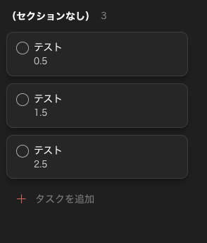
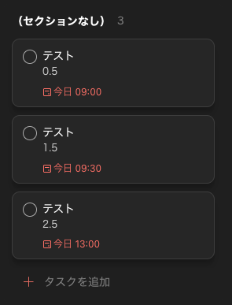

## todoist スケジューラ

Todoist で管理しているタスクに対して 2 つの自動化を提供する。

| ツール | 役割 |
|--------|------|
| `scheduler.py` | 今日の作業時間をタスクに割り当てて due date を一括設定 |
| `task_trigger.py` | due time になったタスクのコメントを Claude Code に自動投入 |

---

### セットアップ

```bash
# .env をコピーして環境変数を設定
cp .env.example .env
# TODOIST_API_TOKEN と TODOIST_PROJECT_ID を記入
```

---

### 1. スケジューラ（scheduler.py）

始業・終業・ランチ時間を渡すと、Todoist のタスクに最適な開始時刻を割り当てる。

```bash
uv run --env-file .env python scheduler.py \
  --start 09:00 --end 18:00 \
  --lunch-start 12:00 --lunch-end 13:00
```

#### 実行前 / 実行後

 

#### オプション

| 引数 | 必須 | 説明 |
|------|------|------|
| `--start` | ✅ | 作業開始時刻（HH:MM） |
| `--end` | ✅ | 作業終了時刻（HH:MM） |
| `--lunch-start` | 任意 | ランチ開始（`--lunch-end` と対で指定） |
| `--lunch-end` | 任意 | ランチ終了 |
| `--date` | 任意 | 対象日（YYYY-MM-DD、省略時は今日） |
| `--project-id` | 任意 | 対象プロジェクト ID（省略時は環境変数） |

---

### 2. タスクトリガー（task_trigger.py）

due time になったタスクのコメントを `claude --print` に自動投入し、結果をログに記録する。

```bash
# 手動実行
$ uv run --env-file .env python task_trigger.py

# cron に登録（15分ごと自動実行）
$ crontab -e
# → crontab.example の内容を参考に追記
```

#### 動作の流れ

1. 現在時刻の 15 分ウィンドウ（例: 09:17 起動 → 09:00〜09:15）に due のタスクを取得
2. タスクのコメント（最新）をプロンプトとして `claude --print` に渡す
3. 実行結果を `~/Library/Logs/task-trigger/task-trigger.log` に JSON Lines で記録

#### 環境変数

| 変数 | 必須 | デフォルト |
|------|------|-----------|
| `TODOIST_API_TOKEN` | ✅ | — |
| `TODOIST_PROJECT_ID` | 任意 | 全タスク |
| `TASK_TRIGGER_WORKDIR` | 任意 | スクリプトと同じディレクトリ |
| `TASK_TRIGGER_LOG` | 任意 | `~/Library/Logs/task-trigger/task-trigger.log` |
| `TASK_TRIGGER_TIMEOUT` | 任意 | `300`（秒） |

---

### 開発コマンド

```bash
uv run ruff check --fix   # lint
uv run ruff format        # format
uv run --env-file .env pytest tests/ -v  # テスト
```
